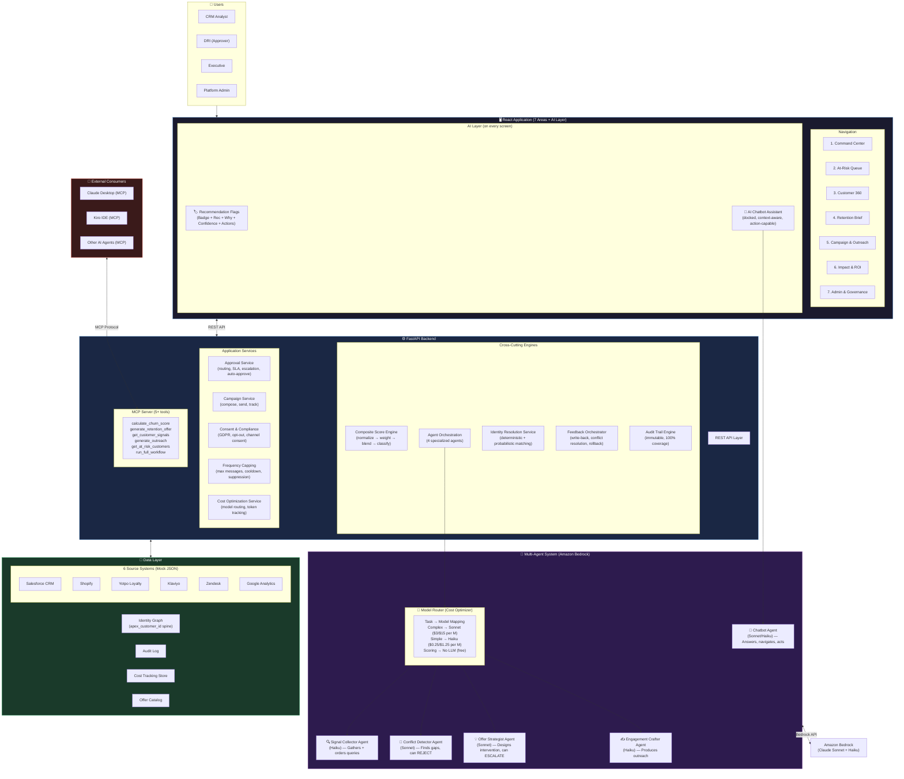
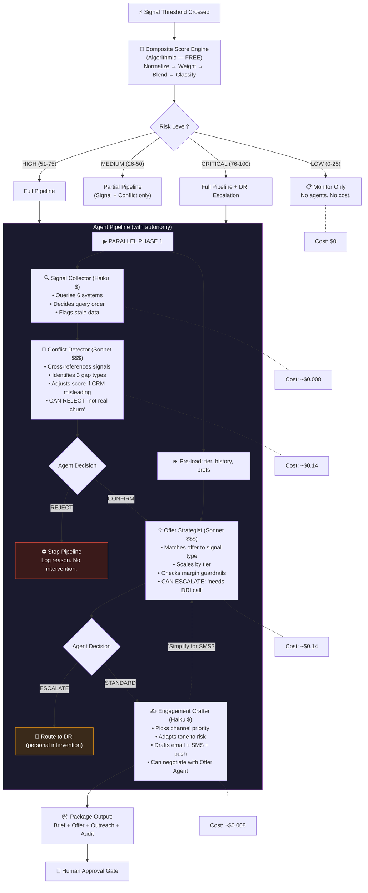
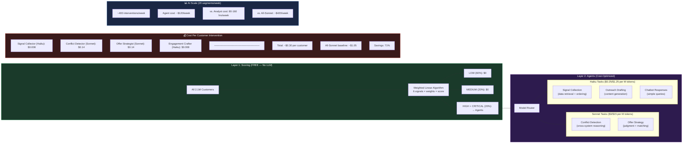
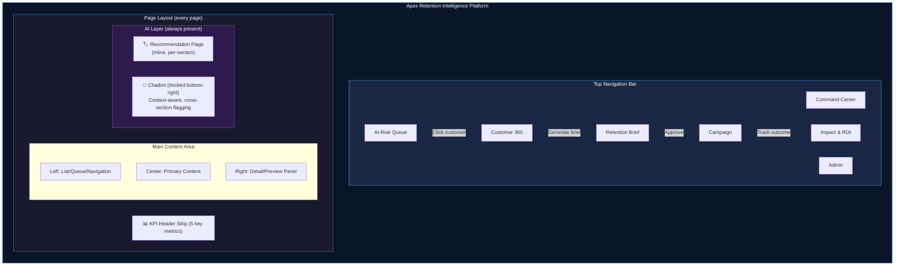
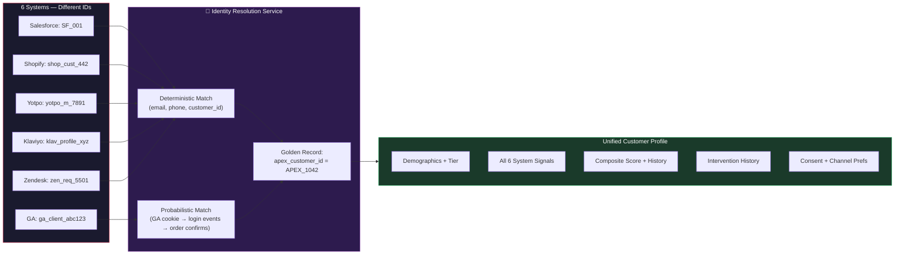
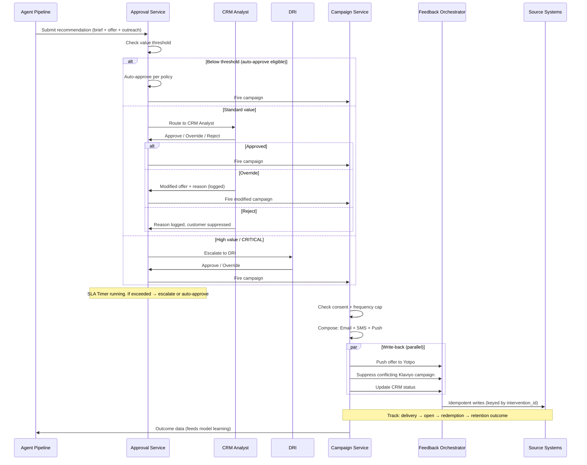
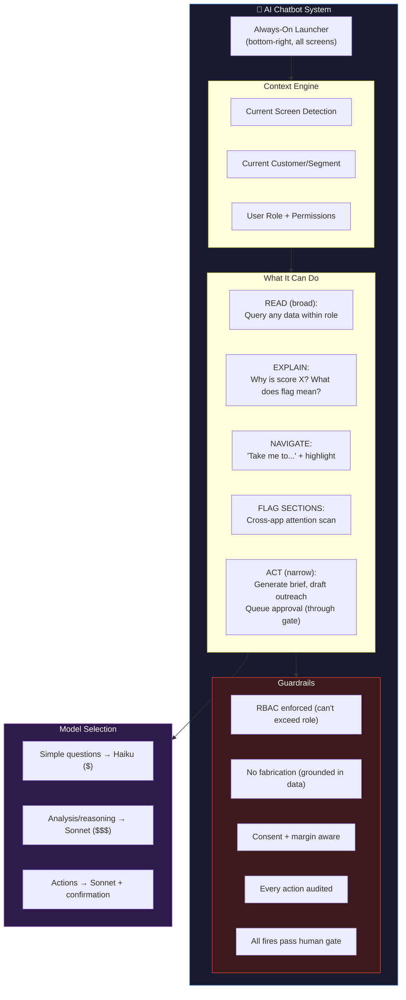
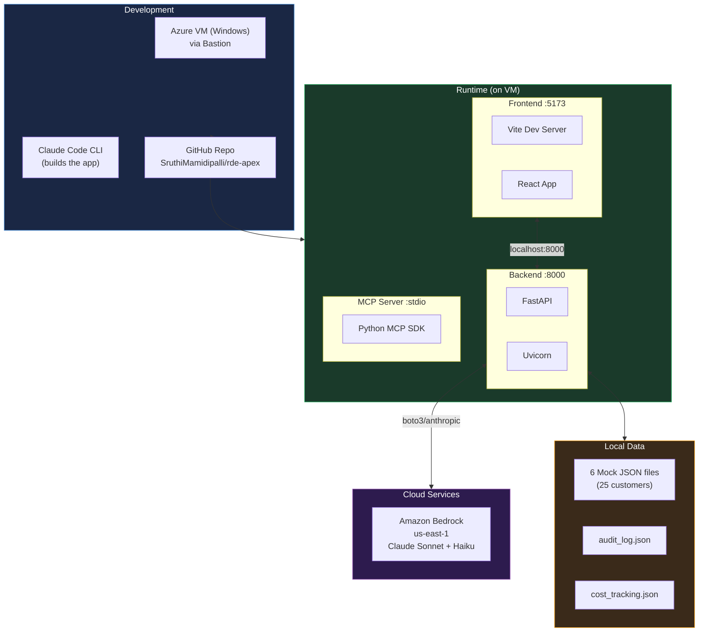

# Apex Retention Intelligence Platform — Technical Architecture

## 1. Full System Architecture

---

## 2. Agent Orchestration Detail

---

## 3. Cost Optimization Architecture

---

## 4. UI Information Architecture

---

## 5. Data Model & Identity Resolution

---

## 6. Approval & Campaign Flow

---

## 7. Chatbot Architecture

---

## 8. Deployment Architecture (Prototype)

---

## Key Architecture Decisions

| Decision | Choice | Rationale |
|----------|--------|-----------|
| Agent pattern | Multi-agent with autonomy (reject/escalate/negotiate) | Truly agentic, not just a pipeline |
| Model routing | Sonnet for reasoning, Haiku for content/retrieval | 71% cost savings, demo differentiator |
| Scoring | Weighted linear, no LLM | Free for all customers, only agents for HIGH+ |
| Identity | Mock golden record (deterministic) | Production would add probabilistic GA matching |
| Write-back | Simulated in prototype | Production: idempotent, conflict-aware |
| Approval | Value-threshold routing + SLA | Prevents DRI bottleneck |
| Chatbot | Sonnet-backed, context-aware, action-capable | Unifies platform access via natural language |
| Audit | 100% coverage, immutable JSON log | Trust mechanism + compliance |
| Cost tracking | Per-request token + model logging | Enables cost dashboard panel |
