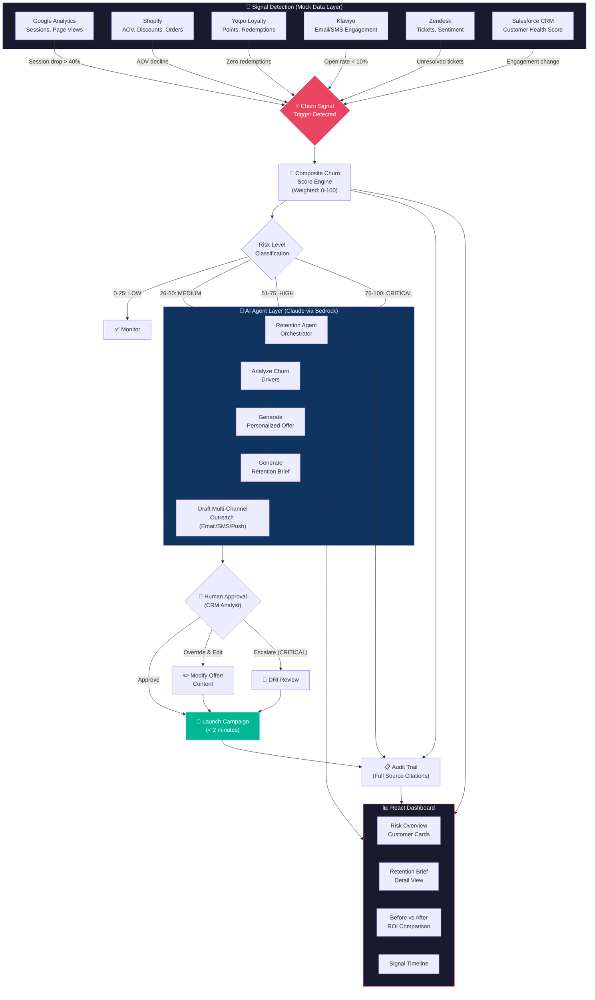
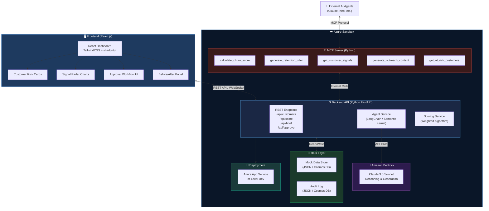
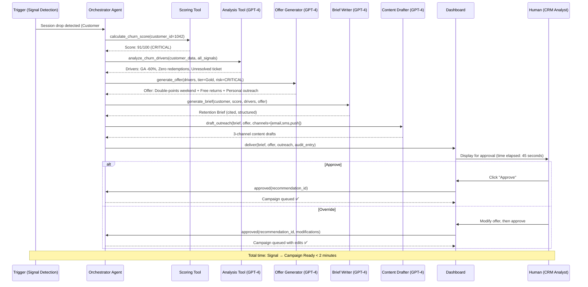

# Apex Loyalty AI Retention — Architecture & Flow Diagrams

## 1. Solution Flow Diagram (End-to-End Agentic Workflow)

---

## 2. Technical Architecture Diagram (Azure Sandbox Deployment)

---

## 3. Agentic Workflow Detail (Multi-Tool Agent Pattern)

---

## 4. Team Delegation (1-Day Sprint)

```mermaid
gantt
    title 1-Day Build Plan — Apex Loyalty AI Retention Prototype
    dateFormat HH:mm
    axisFormat %H:%M

    section Setup (All)
    Azure Sandbox Setup & Repo Init          :setup, 09:00, 30m
    Mock Data Seeding                        :data, after setup, 30m

    section Backend (Sruthi + Saim + Kiro)
    FastAPI Scaffold + Scoring Engine        :backend1, after setup, 1h
    Agent Orchestration (Claude via Bedrock)   :backend2, after backend1, 2h
    MCP Server Implementation               :mcp, after backend2, 1h

    section Frontend (Sunny + Aanya)
    React Dashboard Scaffold                 :fe1, after setup, 1h
    Customer Risk Cards + Radar Chart        :fe2, after fe1, 2h
    Approval Workflow UI                     :fe3, after fe2, 1h
    Before/After Comparison Panel            :fe4, after fe3, 1h

    section Data & Integration (Vishal)
    Cosmos DB Setup (optional)               :db, after data, 1h
    API Integration Testing                  :test, after backend2, 1h

    section Demo Prep (All)
    End-to-End Testing                       :e2e, 16:00, 1h
    Demo Script & Presentation               :demo, after e2e, 1h
```

---

## 5. MCP Tool Exposure Architecture

```mermaid
flowchart LR
    subgraph MCP_SERVER["MCP Server (Python/FastAPI)"]
        direction TB
        T1["🔧 calculate_churn_score<br/>Input: customer_id<br/>Output: score, signals, risk_level"]
        T2["🔧 generate_retention_offer<br/>Input: customer_profile, signals<br/>Output: offer, confidence"]
        T3["🔧 get_customer_signals<br/>Input: customer_id<br/>Output: all 6-system signals"]
        T4["🔧 generate_outreach_content<br/>Input: profile, offer, channel<br/>Output: formatted content"]
        T5["🔧 get_at_risk_customers<br/>Input: threshold<br/>Output: customer list"]
    end

    subgraph CONSUMERS["MCP Consumers"]
        CLAUDE["Claude Desktop"]
        KIRO["Kiro IDE"]
        CUSTOM["Custom AI Agents"]
        CHAT["Chatbot Interfaces"]
    end

    CONSUMERS <-->|"stdio / SSE"| MCP_SERVER

    style MCP_SERVER fill:#2c1810,stroke:#e74c3c,color:#fff
    style CONSUMERS fill:#1a2744,stroke:#4a90d9,color:#fff
```

---

## 6. Component Interaction (Data Flow)

```mermaid
flowchart LR
    subgraph MOCK["Mock Systems (JSON)"]
        M1["salesforce.json"]
        M2["shopify.json"]
        M3["yotpo.json"]
        M4["klaviyo.json"]
        M5["zendesk.json"]
        M6["analytics.json"]
    end

    MOCK --> LOADER["Data Loader<br/>Service"]
    LOADER --> SCORE["Scoring<br/>Engine"]
    SCORE --> AGENT["Retention<br/>Agent"]
    AGENT --> AOAI["Claude via<br/>Bedrock"]
    AOAI --> AGENT
    AGENT --> OUTPUT["Output Layer"]

    subgraph OUTPUT_DETAIL["Outputs"]
        BRIEF_OUT["Retention Brief"]
        OFFER_OUT["Personalized Offer"]
        OUTREACH_OUT["3-Channel Drafts"]
        AUDIT_OUT["Audit Entry"]
    end

    OUTPUT --> OUTPUT_DETAIL
    OUTPUT_DETAIL --> DASH["React Dashboard"]
    OUTPUT_DETAIL --> MCP_OUT["MCP Tools"]

    style MOCK fill:#1a3a2a,stroke:#27ae60,color:#fff
    style OUTPUT_DETAIL fill:#3a1a1a,stroke:#e74c3c,color:#fff
```

---

## Key Design Decisions for 1-Day Build

| Decision | Choice | Rationale |
|----------|--------|-----------|
| Backend Language | Python (FastAPI) | Fastest for AI/LLM integration, team familiarity |
| Frontend | React + TailwindCSS + shadcn/ui | Sunny's strength, rapid component assembly |
| AI Engine | Claude 3.5 Sonnet via Bedrock | Available via bootcamp Bedrock access, excellent structured reasoning |
| Data Store | JSON files (upgrade to Cosmos DB if time) | Zero setup time, easy to seed |
| Agent Framework | anthropic-bedrock SDK or boto3 | Native tool-calling, clean structured output |
| MCP Implementation | Python (mcp SDK) | Same language as backend, simpler deployment |
| Deployment | Azure App Service or local | Demo flexibility |
| Charts | Recharts or Chart.js | Lightweight, React-native |

## Team Allocation (Optimized for 1 Day)

| Person | Role | Focus Area |
|--------|------|------------|
| **Sruthi** | Lead + Agentic AI | Agent orchestration, MCP server, overall architecture |
| **Sunny** | Full-Stack | React dashboard, API endpoints, integration |
| **Saim** | Architect | Backend design, scoring engine, Bedrock setup |
| **Vishal** | Data | Mock data design, Cosmos DB (stretch), data seeding |
| **Aanya** | UI/UX | Dashboard design, component styling, demo visual polish |
| **Mahesh** | Support | Node.js MCP server alternative, data transformation |
| **Priyanka** | Support | Integration testing, demo script preparation |

> **Primary builders**: Sruthi (Agentic + MCP) + Sunny (Dashboard + API) + Saim (Backend Architecture)
> **Kiro/Claude**: Code generation, rapid scaffolding, debugging assistance
