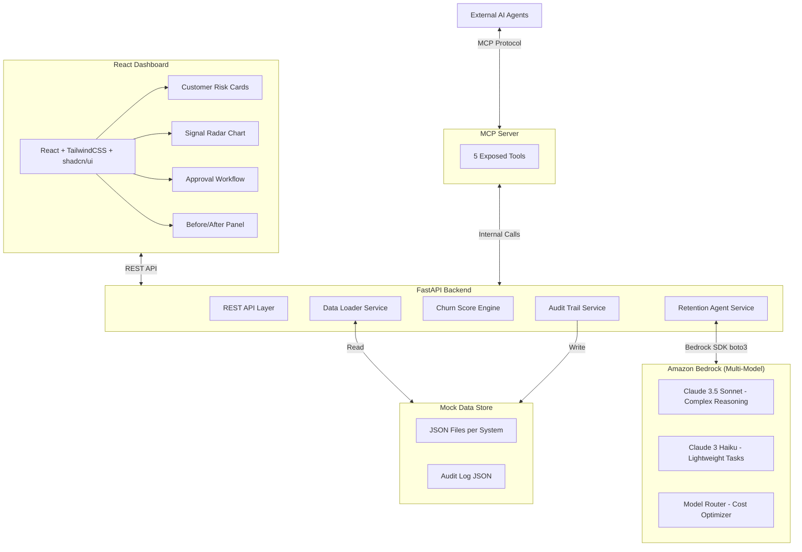

# Design Document: Apex Loyalty AI Retention

## Overview

This design document describes the technical architecture and implementation plan for the Apex Loyalty AI Retention system — a 1-day prototype that demonstrates an AI-powered agentic retention workflow for Apex Retail. The system cross-references 6 siloed mock data sources, computes composite churn scores using a weighted algorithm, generates personalized retention offers via Azure OpenAI GPT-4, enables human-in-the-loop approval, and exposes all capabilities as MCP tools.

**Key Design Goals:**
- Demo-ready within 1 day using Azure Sandbox
- Mock data simulating 6 real systems (Salesforce CRM, Shopify, Yotpo, Klaviyo, Zendesk, Google Analytics)
- End-to-end signal → recommendation → approval cycle under 2 minutes
- Clean separation between data, scoring, AI agent, API, MCP, and UI layers

**Tech Stack:**
- Backend: Python 3.11+ / FastAPI
- Frontend: React 18 + TailwindCSS + shadcn/ui
- AI: Multi-model via Amazon Bedrock (cost-optimized routing)
  - Claude 3.5 Sonnet — complex reasoning (churn analysis, retention briefs)
  - Claude 3 Haiku — lightweight tasks (outreach drafts, formatting)
  - Amazon Titan — embeddings and simple classification (optional)
- Data: JSON files (optional Cosmos DB upgrade)
- MCP: Python `mcp` SDK
- Charts: Recharts

**Cost Optimization Strategy:**
- Route tasks to cheapest model that meets quality threshold
- Heavy reasoning (analysis, offer logic) → Sonnet ($3/M input, $15/M output)
- Content generation (emails, SMS) → Haiku ($0.25/M input, $1.25/M output)
- Simple classification/scoring → rule-based (no LLM cost)
- Estimated 70-80% cost reduction vs. using Sonnet for everything

## Architecture

### High-Level System Architecture



### Request Flow

1. **Trigger Detection**: Data loader scans mock signals → scoring engine computes churn score
2. **Agent Orchestration**: If score > threshold, retention agent is invoked with all customer signals
3. **AI Generation**: Agent calls GPT-4 to analyze drivers, generate offer, brief, and outreach
4. **Delivery**: Results stored in audit log and pushed to dashboard
5. **Human Review**: CRM analyst approves/overrides via dashboard UI
6. **MCP Access**: External agents can invoke any capability via MCP tools

## Components and Interfaces

### Backend Components

#### 1. Data Loader Service (`services/data_loader.py`)

Responsible for reading mock JSON data and providing a unified customer profile across all 6 systems.

```python
class DataLoaderService:
    """Loads and consolidates mock data from 6 simulated systems."""

    def __init__(self, data_dir: str = "data/mock"):
        ...

    def get_customer(self, customer_id: str) -> CustomerProfile:
        """Consolidate all 6 system records into a single profile."""
        ...

    def get_all_customers(self) -> list[CustomerProfile]:
        """Return all customer profiles."""
        ...

    def get_customer_signals(self, customer_id: str) -> CustomerSignals:
        """Return raw signals from all 6 systems for a customer."""
        ...
```

#### 2. Churn Score Engine (`services/scoring_engine.py`)

Computes weighted composite churn scores from multi-system signals.

```python
class ChurnScoreEngine:
    """Weighted composite churn score calculator."""

    DEFAULT_WEIGHTS = {
        "transaction_recency": 0.25,
        "engagement_drop": 0.20,
        "support_sentiment": 0.15,
        "session_decline": 0.15,
        "loyalty_inactivity": 0.15,
        "email_disengagement": 0.10,
    }

    def __init__(self, weights: dict[str, float] | None = None):
        ...

    def calculate_score(self, signals: CustomerSignals) -> ChurnScoreResult:
        """Compute composite score 0-100 with signal attributions."""
        ...

    def classify_risk(self, score: float) -> RiskLevel:
        """Classify into LOW/MEDIUM/HIGH/CRITICAL."""
        ...

    def normalize_weights(self, available_signals: list[str]) -> dict[str, float]:
        """Re-normalize weights when some signals are missing."""
        ...
```

#### 3. Model Router (`services/model_router.py`)

Intelligent model selection based on task complexity for cost optimization.

```python
from enum import Enum
from anthropic import AnthropicBedrock

class TaskComplexity(str, Enum):
    HIGH = "high"       # Complex reasoning, multi-step analysis
    MEDIUM = "medium"   # Structured generation with some reasoning
    LOW = "low"         # Simple formatting, templating, classification

class ModelTier(str, Enum):
    SONNET = "anthropic.claude-3-5-sonnet-20241022-v2:0"   # $3/$15 per M tokens
    HAIKU = "anthropic.claude-3-haiku-20240307-v1:0"       # $0.25/$1.25 per M tokens

# Task-to-model mapping
TASK_MODEL_MAP = {
    "analyze_churn_drivers": ModelTier.SONNET,     # Complex multi-signal reasoning
    "generate_offer": ModelTier.SONNET,            # Needs tier/signal matching logic
    "generate_brief": ModelTier.SONNET,            # Structured analysis with citations
    "generate_outreach_email": ModelTier.HAIKU,    # Template-based content
    "generate_outreach_sms": ModelTier.HAIKU,      # Simple short-form text
    "generate_outreach_push": ModelTier.HAIKU,     # Very short formatting
    "summarize_signals": ModelTier.HAIKU,          # Straightforward summarization
}

class ModelRouter:
    """Routes AI tasks to cost-optimal models based on complexity."""

    def __init__(self, client: AnthropicBedrock):
        self.client = client
        self.usage_log: list[dict] = []  # Track cost per request

    def get_model(self, task_name: str) -> str:
        """Return the optimal model ID for a given task."""
        return TASK_MODEL_MAP.get(task_name, ModelTier.HAIKU).value

    async def invoke(
        self, task_name: str, system_prompt: str, user_message: str,
        max_tokens: int = 4096
    ) -> dict:
        """Route request to appropriate model and track usage."""
        model_id = self.get_model(task_name)
        response = self.client.messages.create(
            model=model_id,
            max_tokens=max_tokens,
            system=system_prompt,
            messages=[{"role": "user", "content": user_message}]
        )
        # Log usage for cost dashboard
        self.usage_log.append({
            "task": task_name,
            "model": model_id,
            "input_tokens": response.usage.input_tokens,
            "output_tokens": response.usage.output_tokens,
            "estimated_cost": self._estimate_cost(model_id, response.usage)
        })
        return {"content": response.content[0].text, "model_used": model_id}

    def _estimate_cost(self, model_id: str, usage) -> float:
        """Estimate cost in USD."""
        if "sonnet" in model_id:
            return (usage.input_tokens * 3 + usage.output_tokens * 15) / 1_000_000
        else:  # haiku
            return (usage.input_tokens * 0.25 + usage.output_tokens * 1.25) / 1_000_000

    def get_cost_summary(self) -> dict:
        """Return cost breakdown for dashboard display."""
        total = sum(e["estimated_cost"] for e in self.usage_log)
        by_model = {}
        for entry in self.usage_log:
            model = "Sonnet" if "sonnet" in entry["model"] else "Haiku"
            by_model[model] = by_model.get(model, 0) + entry["estimated_cost"]
        # Calculate savings vs all-Sonnet baseline
        all_sonnet_cost = sum(
            (e["input_tokens"] * 3 + e["output_tokens"] * 15) / 1_000_000
            for e in self.usage_log
        )
        savings_pct = ((all_sonnet_cost - total) / all_sonnet_cost * 100) if all_sonnet_cost > 0 else 0
        return {
            "total_cost": total,
            "by_model": by_model,
            "all_sonnet_baseline": all_sonnet_cost,
            "savings_percentage": savings_pct,
            "total_requests": len(self.usage_log)
        }
```

#### 4. Retention Agent Service (`services/retention_agent.py`)

Orchestrates the multi-step AI workflow: analysis → offer → brief → outreach using the Model Router for cost-optimized model selection.

```python
from services.model_router import ModelRouter

class RetentionAgentService:
    """AI agent orchestrator using multi-model routing via Amazon Bedrock."""

    def __init__(self, model_router: ModelRouter, config: AgentConfig):
        ...

    async def run_retention_workflow(
        self, customer_id: str
    ) -> RetentionWorkflowResult:
        """Full pipeline: score → analyze → offer → brief → outreach."""
        ...

    async def analyze_churn_drivers(
        self, customer: CustomerProfile, signals: CustomerSignals
    ) -> ChurnAnalysis:
        """Use GPT-4 to identify primary churn drivers with citations."""
        ...

    async def generate_offer(
        self, analysis: ChurnAnalysis, tier: CustomerTier, risk: RiskLevel
    ) -> RetentionOffer:
        """Generate tier-matched, signal-appropriate offer."""
        ...

    async def generate_brief(
        self, customer: CustomerProfile, score: ChurnScoreResult,
        analysis: ChurnAnalysis, offer: RetentionOffer
    ) -> RetentionBrief:
        """Generate structured retention brief with citations."""
        ...

    async def generate_outreach(
        self, customer: CustomerProfile, offer: RetentionOffer,
        channels: list[str]
    ) -> dict[str, OutreachContent]:
        """Generate multi-channel outreach drafts."""
        ...
```

#### 4. Approval Service (`services/approval_service.py`)

Manages human-in-the-loop approval workflow.

```python
class ApprovalService:
    """Human-in-the-loop approval workflow management."""

    def __init__(self, audit_service: AuditService, config: ApprovalConfig):
        ...

    def submit_for_approval(
        self, recommendation: RetentionWorkflowResult
    ) -> PendingApproval:
        """Queue recommendation for CRM analyst review."""
        ...

    def approve(
        self, approval_id: str, approver: str, modifications: dict | None = None
    ) -> ApprovalDecision:
        """Approve recommendation (with optional modifications)."""
        ...

    def escalate(self, approval_id: str, reason: str) -> EscalationRecord:
        """Escalate CRITICAL risk recommendations to DRI."""
        ...

    def get_pending(self) -> list[PendingApproval]:
        """Return all pending recommendations sorted by risk level."""
        ...
```

#### 5. Audit Service (`services/audit_service.py`)

Logs all decisions and recommendations with full traceability.

```python
class AuditService:
    """Audit trail management for all agent actions and decisions."""

    def __init__(self, storage_path: str = "data/audit"):
        ...

    def log_recommendation(self, entry: AuditEntry) -> str:
        """Log agent recommendation with full context."""
        ...

    def log_decision(self, decision: ApprovalDecision) -> str:
        """Log human approval/override decision."""
        ...

    def query(
        self, customer_id: str | None = None,
        date_range: tuple | None = None,
        risk_level: RiskLevel | None = None,
        approver: str | None = None
    ) -> list[AuditEntry]:
        """Query audit entries by multiple filters."""
        ...
```

#### 6. MCP Server (`mcp_server/server.py`)

Exposes 5 tools following the MCP specification.

```python
from mcp.server import Server
from mcp.types import Tool

server = Server("apex-retention")

@server.tool()
async def calculate_churn_score(customer_id: str) -> dict:
    """Calculate composite churn score for a customer.
    Returns: score (0-100), signal breakdown, risk level."""
    ...

@server.tool()
async def generate_retention_offer(
    customer_id: str, signals: dict | None = None
) -> dict:
    """Generate personalized retention offer.
    Returns: offer details, confidence score."""
    ...

@server.tool()
async def get_customer_signals(customer_id: str) -> dict:
    """Retrieve all signals from 6 simulated systems.
    Returns: signals per system with timestamps."""
    ...

@server.tool()
async def generate_outreach_content(
    customer_id: str, offer: dict, channel: str
) -> dict:
    """Generate formatted outreach content for a channel.
    Returns: formatted content (email/sms/push)."""
    ...

@server.tool()
async def get_at_risk_customers(threshold: int = 50) -> dict:
    """Get customers exceeding churn score threshold.
    Returns: list of customers with scores and risk levels."""
    ...
```

### API Endpoints (`api/routes.py`)

```python
# Customer endpoints
GET  /api/customers                    → List all customers with scores
GET  /api/customers/{id}               → Customer profile with signals
GET  /api/customers/{id}/signals       → Raw signals from all 6 systems
GET  /api/customers/{id}/audit         → Audit trail for customer

# Scoring endpoints
POST /api/score/{customer_id}          → Trigger score calculation
GET  /api/score/at-risk?threshold=50   → Get at-risk customers

# Agent endpoints
POST /api/agent/run/{customer_id}      → Trigger full retention workflow
GET  /api/agent/brief/{customer_id}    → Get latest retention brief

# Approval endpoints
GET  /api/approvals/pending            → List pending approvals
POST /api/approvals/{id}/approve       → Approve recommendation
POST /api/approvals/{id}/override      → Override with modifications
POST /api/approvals/{id}/escalate      → Escalate to DRI

# Dashboard endpoints
GET  /api/dashboard/metrics            → Aggregate metrics
GET  /api/dashboard/comparison         → Before vs After metrics
GET  /api/dashboard/cost-optimization  → Model routing cost breakdown & savings
```

### Frontend Components

```
src/
├── components/
│   ├── CustomerCard.tsx          # Risk-colored customer card
│   ├── SignalRadarChart.tsx       # 6-axis radar chart (Recharts)
│   ├── RetentionBriefPanel.tsx   # Full brief display
│   ├── ApprovalWorkflow.tsx      # Approve/Override/Escalate buttons
│   ├── OutreachPreview.tsx       # Email/SMS/Push tabs
│   ├── ComparisonPanel.tsx       # Before vs After metrics
│   ├── CostOptimizationPanel.tsx # Model routing cost breakdown & savings
│   ├── TimelineView.tsx          # Signal → Action timeline
│   ├── MetricsBar.tsx            # Aggregate stats header
│   └── ThemeToggle.tsx           # Dark/Light mode switch
├── pages/
│   ├── DashboardPage.tsx         # Main risk overview
│   └── CustomerDetailPage.tsx    # Individual customer deep-dive
├── hooks/
│   ├── useCustomers.ts           # Fetch customer list
│   ├── useApprovals.ts           # Approval state management
│   └── useMetrics.ts             # Dashboard aggregate data
└── lib/
    └── api.ts                    # API client wrapper
```

## Data Models

### Core Domain Models

```python
from pydantic import BaseModel, Field
from enum import Enum
from datetime import datetime

class RiskLevel(str, Enum):
    LOW = "LOW"           # 0-25
    MEDIUM = "MEDIUM"     # 26-50
    HIGH = "HIGH"         # 51-75
    CRITICAL = "CRITICAL" # 76-100

class CustomerTier(str, Enum):
    BRONZE = "Bronze"
    SILVER = "Silver"
    GOLD = "Gold"
    PLATINUM = "Platinum"

# --- Source System Signals ---

class SalesforceData(BaseModel):
    customer_id: str
    engagement_score: float = Field(ge=0, le=100)
    last_interaction_date: datetime
    health_score: float = Field(ge=0, le=100)
    lifecycle_stage: str

class ShopifyData(BaseModel):
    customer_id: str
    average_order_value: float
    order_count_30d: int
    discount_usage_rate: float = Field(ge=0, le=1)
    last_purchase_date: datetime
    aov_change_pct: float  # negative = decline

class YotpoData(BaseModel):
    customer_id: str
    points_balance: int
    points_earned_30d: int
    redemptions_30d: int
    tier: CustomerTier
    days_since_last_redemption: int

class KlaviyoData(BaseModel):
    customer_id: str
    email_open_rate: float = Field(ge=0, le=1)
    email_click_rate: float = Field(ge=0, le=1)
    sms_response_rate: float = Field(ge=0, le=1)
    unsubscribed: bool
    last_email_open_date: datetime | None

class ZendeskData(BaseModel):
    customer_id: str
    open_tickets: int
    avg_sentiment_score: float = Field(ge=-1, le=1)  # -1 negative, +1 positive
    unresolved_tickets: int
    avg_resolution_time_hours: float
    last_ticket_date: datetime | None

class GoogleAnalyticsData(BaseModel):
    customer_id: str
    sessions_30d: int
    sessions_prev_30d: int
    avg_session_duration_sec: float
    pages_per_session: float
    bounce_rate: float = Field(ge=0, le=1)
    session_change_pct: float  # negative = decline

# --- Composite Models ---

class CustomerSignals(BaseModel):
    salesforce: SalesforceData | None = None
    shopify: ShopifyData | None = None
    yotpo: YotpoData | None = None
    klaviyo: KlaviyoData | None = None
    zendesk: ZendeskData | None = None
    google_analytics: GoogleAnalyticsData | None = None

class SignalContribution(BaseModel):
    source: str
    signal_name: str
    raw_value: float
    normalized_score: float  # 0-100 (higher = more churn risk)
    weight: float
    weighted_contribution: float

class ChurnScoreResult(BaseModel):
    customer_id: str
    composite_score: float = Field(ge=0, le=100)
    risk_level: RiskLevel
    signal_contributions: list[SignalContribution]
    computed_at: datetime
    missing_signals: list[str] = []

class CustomerProfile(BaseModel):
    customer_id: str
    name: str
    email: str
    tier: CustomerTier
    join_date: datetime
    signals: CustomerSignals
    churn_score: ChurnScoreResult | None = None

# --- Agent Output Models ---

class ChurnDriver(BaseModel):
    driver: str
    source_system: str
    evidence: str
    severity: str  # "high", "medium", "low"

class ChurnAnalysis(BaseModel):
    customer_id: str
    drivers: list[ChurnDriver]
    summary: str
    generated_at: datetime

class RetentionOffer(BaseModel):
    offer_id: str
    customer_id: str
    offer_type: str  # "discount", "bonus_points", "exclusive_access", "service_recovery"
    description: str
    value: str
    matched_signal: str
    confidence_score: float = Field(ge=0, le=100)
    tier_justification: str

class OutreachContent(BaseModel):
    channel: str  # "email", "sms", "push"
    subject: str | None = None  # email only
    body: str
    call_to_action: str | None = None
    character_count: int | None = None

class RetentionBrief(BaseModel):
    brief_id: str
    customer_id: str
    customer_summary: str
    risk_classification: RiskLevel
    churn_score: float
    signal_breakdown: list[SignalContribution]
    historical_comparison: str
    recommended_offer: RetentionOffer
    outreach_strategy: str
    generated_at: datetime

class RetentionWorkflowResult(BaseModel):
    workflow_id: str
    customer_id: str
    score: ChurnScoreResult
    analysis: ChurnAnalysis
    offer: RetentionOffer
    brief: RetentionBrief
    outreach: dict[str, OutreachContent]
    elapsed_seconds: float
    completed_at: datetime

# --- Approval Models ---

class ApprovalStatus(str, Enum):
    PENDING = "pending"
    APPROVED = "approved"
    OVERRIDDEN = "overridden"
    ESCALATED = "escalated"

class PendingApproval(BaseModel):
    approval_id: str
    workflow_result: RetentionWorkflowResult
    status: ApprovalStatus = ApprovalStatus.PENDING
    submitted_at: datetime
    time_since_signal_seconds: float

class ApprovalDecision(BaseModel):
    approval_id: str
    approver: str
    decision: ApprovalStatus
    modifications: dict | None = None
    decided_at: datetime

# --- Audit Models ---

class AuditEntry(BaseModel):
    entry_id: str
    customer_id: str
    timestamp: datetime
    event_type: str  # "recommendation", "approval", "escalation"
    churn_score: float | None = None
    risk_level: RiskLevel | None = None
    sources_consulted: list[str] = []
    offer_type: str | None = None
    offer_value: str | None = None
    confidence_score: float | None = None
    approver: str | None = None
    decision: str | None = None
    modifications: dict | None = None
```

### Mock Data File Structure

```
data/
├── mock/
│   ├── salesforce.json       # CRM engagement data
│   ├── shopify.json          # Transaction/order data
│   ├── yotpo.json            # Loyalty points & tiers
│   ├── klaviyo.json          # Email/SMS engagement
│   ├── zendesk.json          # Support tickets & sentiment
│   └── google_analytics.json # Session/browsing patterns
├── audit/
│   └── audit_log.json        # Audit trail entries
└── seed.py                   # Script to generate 20+ customers
```

### Backend Project Structure

```
backend/
├── main.py                   # FastAPI app entry point
├── config.py                 # Settings (Bedrock region, model ID, thresholds)
├── api/
│   ├── __init__.py
│   ├── routes.py             # All REST endpoints
│   └── dependencies.py       # Dependency injection
├── services/
│   ├── __init__.py
│   ├── data_loader.py        # Mock data consolidation
│   ├── scoring_engine.py     # Weighted churn scoring
│   ├── model_router.py       # Multi-model cost-optimized routing
│   ├── retention_agent.py    # Multi-model agent orchestration
│   ├── approval_service.py   # Human-in-the-loop workflow
│   └── audit_service.py      # Audit trail management
├── models/
│   ├── __init__.py
│   ├── domain.py             # Core data models (above)
│   └── api_models.py         # Request/Response schemas
├── mcp_server/
│   ├── __init__.py
│   └── server.py             # MCP tool definitions
├── data/
│   ├── mock/                 # JSON mock data files
│   ├── audit/                # Audit log storage
│   └── seed.py               # Data seeding script
├── prompts/
│   ├── analyze_drivers.txt   # GPT-4 system prompt for analysis
│   ├── generate_offer.txt    # GPT-4 system prompt for offers
│   ├── generate_brief.txt    # GPT-4 system prompt for briefs
│   └── generate_outreach.txt # GPT-4 system prompt for outreach
├── requirements.txt
└── Dockerfile
```


## Correctness Properties

*A property is a characteristic or behavior that should hold true across all valid executions of a system — essentially, a formal statement about what the system should do. Properties serve as the bridge between human-readable specifications and machine-verifiable correctness guarantees.*

### Property 1: Composite Score Bounded Invariant

*For any* valid set of customer signals (including any subset of 1 to 6 systems present), the computed composite churn score SHALL always be in the range [0, 100], and the internal weights SHALL normalize to sum to 1.0 regardless of which signals are missing.

**Validates: Requirements 2.1, 2.6**

### Property 2: Signal Contributions Sum to Composite Score

*For any* computed churn score result, the sum of all `weighted_contribution` values in the signal contributions list SHALL equal the composite score (within floating-point tolerance), and each contribution SHALL reference a valid source system name from the input signals.

**Validates: Requirements 2.2, 2.4**

### Property 3: Risk Level Classification Boundaries

*For any* composite score in [0, 100], the risk level classification SHALL be LOW if score ∈ [0, 25], MEDIUM if score ∈ [26, 50], HIGH if score ∈ [51, 75], and CRITICAL if score ∈ [76, 100]. The classification function is a total function — no score produces an undefined result.

**Validates: Requirements 2.3**

### Property 4: Signal-to-Offer Type Mapping

*For any* set of churn drivers where a single signal category dominates, the generated offer type SHALL correspond to the category mapping: transaction-dominant → discount or bonus_points; engagement-dominant → exclusive_access or personalized_recommendations; support-dominant → priority_support or compensation.

**Validates: Requirements 4.1, 4.3, 4.4, 4.5**

### Property 5: Offer Value Monotonic with Customer Tier

*For any* two customers with identical churn signals and risk levels but different loyalty tiers, the customer with the higher tier (Bronze < Silver < Gold < Platinum) SHALL receive an offer of equal or greater value than the customer with the lower tier.

**Validates: Requirements 4.2**

### Property 6: Confidence Score Bounded

*For any* generated retention offer, the confidence score SHALL be in the range [0, 100].

**Validates: Requirements 4.6**

### Property 7: Retention Brief Structural Completeness

*For any* generated retention brief, it SHALL contain non-empty values for: customer_summary, risk_classification, signal_breakdown (with at least one entry), recommended_offer, and outreach_strategy. Each signal_breakdown entry SHALL reference a source system present in the input customer signals.

**Validates: Requirements 5.1, 5.2**

### Property 8: Outreach Channel Structure Validity

*For any* generated outreach content set, exactly three channels SHALL be produced (email, SMS, push). The email channel SHALL contain non-empty subject, body, and call_to_action fields.

**Validates: Requirements 6.1, 6.2**

### Property 9: SMS Character Limit

*For any* generated SMS outreach content, the body text SHALL be at most 160 characters in length.

**Validates: Requirements 6.3**

### Property 10: Push Notification Character Limits

*For any* generated push notification outreach content, the title SHALL be at most 50 characters and the body SHALL be at most 100 characters.

**Validates: Requirements 6.4**

### Property 11: Outreach Content Personalization

*For any* generated outreach content (across all channels), the body text SHALL contain the customer's name and SHALL reference the specific offer details from the associated retention offer.

**Validates: Requirements 6.6**

### Property 12: Approval Audit Entry Completeness

*For any* approval decision recorded in the audit trail, the entry SHALL contain: a non-empty approver identity, a valid timestamp, the decision type (approved/overridden/escalated), and whether modifications were made.

**Validates: Requirements 7.4**

### Property 13: CRITICAL Risk Escalation Rule

*For any* recommendation where the customer's risk level is CRITICAL and the offer value exceeds the configurable threshold, the approval system SHALL escalate to DRI. For any recommendation where either condition is NOT met, escalation SHALL NOT occur.

**Validates: Requirements 7.5**

### Property 14: Customer List Sorted by Churn Score

*For any* list of customers returned by the dashboard endpoint, the list SHALL be sorted in descending order by composite churn score.

**Validates: Requirements 8.1**

### Property 15: Aggregate Metrics Correctness

*For any* set of customers and approval states, the aggregate metrics SHALL satisfy: total_at_risk equals the count of customers with score > threshold, average_score equals the arithmetic mean of all scores, pending_count equals the count of PENDING approvals, and launched_count equals the count of APPROVED approvals.

**Validates: Requirements 8.7**

### Property 16: MCP Invalid Input Error Handling

*For any* MCP tool invocation with invalid parameters (wrong types, missing required fields, out-of-range values), the server SHALL return a structured error response containing a descriptive error message, and SHALL NOT raise an unhandled exception.

**Validates: Requirements 10.6**

### Property 17: Audit Query Filter Correctness

*For any* set of audit entries and any query filter combination (customer_id, date_range, risk_level, approver), all returned entries SHALL match every specified filter criterion, and no entry matching all criteria SHALL be excluded from the result.

**Validates: Requirements 11.4**

### Property 18: Workflow Priority Ordering

*For any* set of triggered retention workflows with mixed risk levels, the processing order SHALL be: all CRITICAL before any HIGH, all HIGH before any MEDIUM, all MEDIUM before any LOW.

**Validates: Requirements 12.3**

## Error Handling

### Claude via Bedrock Errors

| Error Type | Handling Strategy |
|-----------|-------------------|
| API timeout (>30s) | Retry once with exponential backoff (2s wait). If retry fails, log error and return partial result with error status. |
| Rate limiting (ThrottlingException) | Queue the request with backoff. Surface "processing" status to UI. |
| Invalid response format | Log the raw response, return a fallback brief with "AI generation failed" message and manual intervention flag. |
| Authentication failure (AccessDeniedException) | Log immediately, surface error to operator. System enters degraded mode (scoring still works, AI features disabled). |
| Model not available (ModelNotReadyException) | Fall back to claude-3-haiku if sonnet unavailable. |

### Data Layer Errors

| Error Type | Handling Strategy |
|-----------|-------------------|
| Missing customer ID | Return 404 with descriptive message. |
| Corrupted JSON file | Log corruption, skip affected system, score with available signals (weight normalization). |
| Missing mock data file | Log warning at startup. Affected system treated as "missing signal" for all customers. |

### MCP Server Errors

| Error Type | Handling Strategy |
|-----------|-------------------|
| Invalid tool parameters | Return structured MCP error with field-level validation messages. |
| Internal processing error | Return MCP error with generic message; log stack trace internally. |
| Timeout on AI-dependent tools | Return partial results with timeout flag after 30s. |

### Frontend Error States

| Scenario | UI Behavior |
|----------|-------------|
| API unreachable | Display connection error banner with retry button. |
| Partial data load | Render available data, show "data unavailable" placeholder for missing sections. |
| Approval action failure | Show toast error, keep form state for retry. |
| Chart data malformed | Render empty chart with "No data available" message. |

### Graceful Degradation Strategy

The system operates in three modes:
1. **Full mode**: All services healthy — complete AI-powered workflow.
2. **Degraded mode**: Azure OpenAI unavailable — scoring works, AI features show "unavailable" status. Analysts can still see scores and signals.
3. **Offline mode**: Backend unreachable — frontend shows last cached data (if implemented) or connection error.

## Testing Strategy

### Test Pyramid

```
         ┌──────────┐
         │  E2E (3) │  Full workflow demo scenarios
         ├──────────┤
         │ Integration (10-15) │  API + service integration
         ├────────────────────┤
         │ Property Tests (18) │  Universal correctness via PBT
         ├─────────────────────┤
         │ Unit Tests (20-30) │  Specific examples + edge cases
         └─────────────────────┘
```

### Property-Based Testing Configuration

**Library**: [Hypothesis](https://hypothesis.readthedocs.io/) (Python PBT library)

**Configuration**:
- Minimum 100 examples per property test
- Deadline: 10 seconds per example (generous for Azure OpenAI mocks)
- Database for reproducibility enabled
- Seed stored for CI determinism

**Tag format**: Each property test tagged with:
```python
# Feature: apex-loyalty-ai-retention, Property {N}: {property_text}
```

**Key Property Test Files**:
- `tests/properties/test_scoring_properties.py` — Properties 1, 2, 3
- `tests/properties/test_offer_properties.py` — Properties 4, 5, 6
- `tests/properties/test_brief_properties.py` — Property 7
- `tests/properties/test_outreach_properties.py` — Properties 8, 9, 10, 11
- `tests/properties/test_approval_properties.py` — Properties 12, 13
- `tests/properties/test_dashboard_properties.py` — Properties 14, 15
- `tests/properties/test_mcp_properties.py` — Property 16
- `tests/properties/test_audit_properties.py` — Property 17
- `tests/properties/test_workflow_properties.py` — Property 18

### Unit Tests (Example-Based)

Focus areas:
- Specific customer scenarios (e.g., "Gold tier customer with 90% session drop")
- Edge cases: all signals missing, all scores at boundary values (0, 25, 26, 50, 51, 75, 76, 100)
- Error paths: Azure OpenAI failures, malformed data
- Approval workflow: approve, override, escalate happy paths

### Integration Tests

- API endpoint response structure validation
- MCP tool invocation end-to-end (with mocked Azure OpenAI)
- Data loader → scoring → agent pipeline integration
- Audit trail persistence and retrieval

### Frontend Tests

- Component rendering with mock data (React Testing Library)
- Approval action state transitions
- Theme toggle functionality
- Responsive layout checks

### Test Execution Plan for 1-Day Build

Given the time constraint, prioritize:
1. **Property tests for scoring engine** (Properties 1-3) — highest value, pure logic
2. **Unit tests for offer type mapping** — core business logic
3. **Integration smoke tests** — verify API endpoints return valid shapes
4. **Skip extensive E2E tests** — rely on manual demo walkthrough

### Mocking Strategy

- **Claude via Bedrock**: Mock at the `anthropic` client level. Return deterministic structured responses that exercise the parsing/validation logic.
- **Data Layer**: Already mock data — no additional mocking needed.
- **Time**: Mock `datetime.now()` for deterministic audit timestamps in tests.

