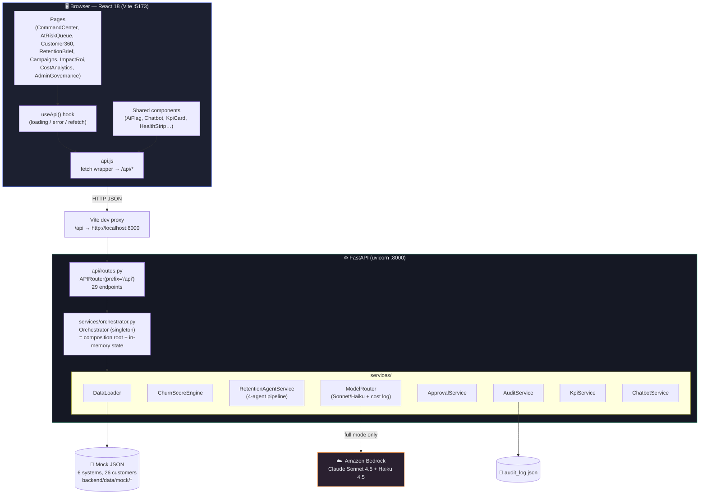
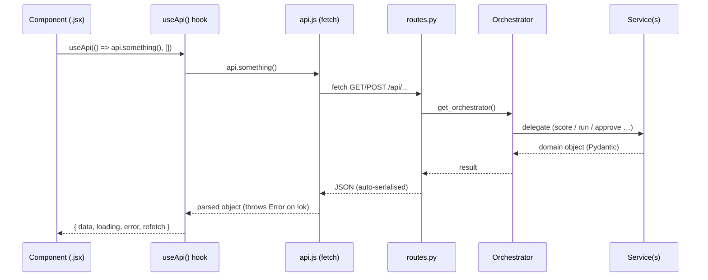
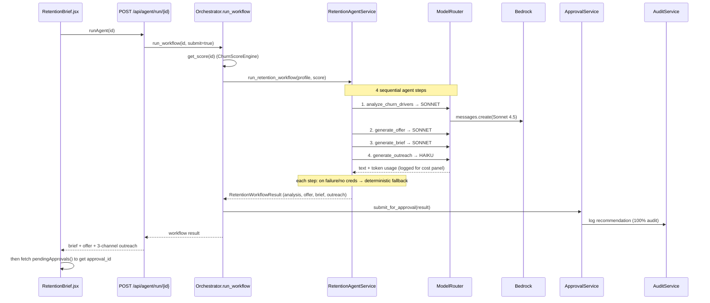
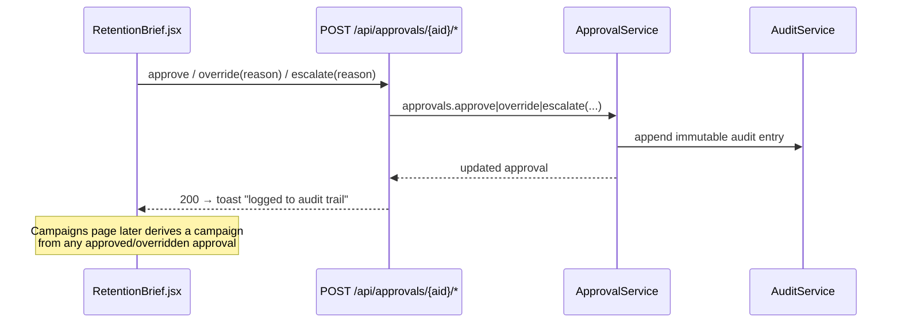
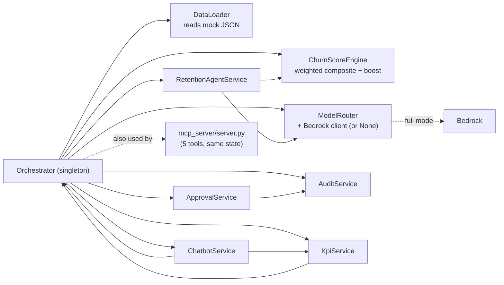

# Apex Retention Platform — End-to-End Flow (Developer Guide)

How a click in the React UI travels to the FastAPI backend and back. Every
mapping below is taken from the actual source (`frontend/src/lib/api.js`,
`backend/api/routes.py`, `backend/services/*`), not idealised.

---

## 1. The big picture (layers)

**Key facts**
- The frontend never talks to Bedrock or the mock data directly — only to `/api/*`.
- In production build there's no Vite proxy; set `VITE_API_BASE` to the backend origin. In dev, `vite.config.js` proxies `/api → :8000`.
- The **Orchestrator is a singleton** (`get_orchestrator()`). All state — scores, workflows, approvals, audit, model-usage — lives in memory inside it, shared by both the REST API and the MCP server.

---

## 2. How one request flows (generic lifecycle)

- **`api.js`** builds every URL as `` `${BASE}/api${path}` ``, sets JSON headers, and on a non-2xx response throws `Error("<status>: <detail>")` (it reads FastAPI's `detail`).
- **`useApi(fn, deps)`** wraps that in `{ data, loading, error, refetch }`. Read-only pages call it at mount; action buttons call `api.*` imperatively and then `refetch()`.
- **`routes.py`** functions are thin — they call `get_orchestrator()` and delegate. Business logic lives in services.

---

## 3. Full endpoint map (what calls what)

Every `api.js` method → route → orchestrator/service. `[POST]` marked; rest are GET.

| `api.js` method | HTTP route | Orchestrator / service call |
|---|---|---|
| `health()` | `/api/health` | `orch.degraded` |
| `listCustomers()` | `/api/customers` | `score_all()` → `data_loader.get_all_customers()` → `_summary()` |
| `getCustomer(id)` | `/api/customers/{id}` | `data_loader.get_customer()` + `get_score()` |
| `getSignals(id)` | `/api/customers/{id}/signals` | `data_loader.get_customer_signals()` |
| `getAudit(id)` | `/api/customers/{id}/audit` | `audit.get_customer_history()` |
| `score(id)` `[POST]` | `/api/score/{id}` | `scoring.calculate_score()` via `orch.score_customer()` |
| `atRisk(t)` | `/api/score/at-risk?threshold=` | `score_all()` + filter |
| `rankedQueue(t)` | `/api/queue/ranked?threshold=` | `score_all()` + sort by `value_rank` (risk×value) |
| `runAgent(id)` `[POST]` | `/api/agent/run/{id}` | `run_workflow()` → `agent.run_retention_workflow()` → `approvals.submit_for_approval()` |
| `runAll(t)` `[POST]` | `/api/agent/run-all?threshold=` | `run_triggered_workflows()` (priority order) |
| `getBrief(id)` | `/api/agent/brief/{id}` | `get_workflow()` (returns `available:false` if none) |
| `pendingApprovals()` | `/api/approvals/pending` | `approvals.get_pending()` |
| `approve(aid)` `[POST]` | `/api/approvals/{aid}/approve` | `approvals.approve()` → `audit` |
| `override(aid,mods)` `[POST]` | `/api/approvals/{aid}/override` | `approvals.override()` → `audit` |
| `escalate(aid,reason)` `[POST]` | `/api/approvals/{aid}/escalate` | `approvals.escalate()` → `audit` |
| `metrics()` | `/api/dashboard/metrics` | `orch.metrics()` |
| `comparison()` | `/api/dashboard/comparison` | static manual-vs-agentic list |
| `costOptimization()` | `/api/dashboard/cost-optimization` | `router.get_cost_summary()` |
| `signalsFeed()` | `/api/dashboard/signals-feed` | `orch.signals_feed()` |
| `systemHealth()` | `/api/dashboard/system-health` | `orch.system_health()` |
| `kpiCommandCenter()` | `/api/kpi/command-center` | `kpi.command_center()` |
| `kpiAtRiskQueue()` | `/api/kpi/at-risk-queue` | `kpi.at_risk_queue()` |
| `kpiImpactRoi()` | `/api/kpi/impact-roi` | `kpi.impact_roi()` |
| `kpiAdmin()` | `/api/kpi/admin` | `kpi.admin()` |
| `costPerCustomer()` | `/api/kpi/cost-per-customer` | `kpi.cost_per_customer()` |
| `campaigns()` | `/api/campaigns` | derived from `approvals.all()` + simulated perf |
| `adminConfig()` | `/api/admin/config` | `scoring.weights / SIGNAL_SOURCE / SIGNAL_LABEL` |
| `adminAudit(limit)` | `/api/admin/audit?limit=` | `audit.all_entries()` (sorted desc) |
| `chatbot(msg,ctx)` `[POST]` | `/api/chatbot` | `chatbot.answer(message, context)` |

---

## 4. Per-page wiring (what each screen fetches)

Each page sets its chatbot context via `setContext({page, customer_id})` on mount,
then fires these calls:

| Page | On load it calls | On user action |
|---|---|---|
| **CommandCenter** | `kpiCommandCenter()`, `signalsFeed()`, `pendingApprovals()` | click signal → nav to Customer360; click approval → nav to Brief |
| **AtRiskQueue** | `rankedQueue(0)`, `kpiAtRiskQueue()` | "Run agents" → `runAll(50)` then refetch; row → Customer360; "Brief →" → Brief |
| **Customer360** | `rankedQueue(0)` (list), then per-customer `getCustomer(id)` + `score(id)` | select customer → re-fetch; "Generate Brief" → nav to Brief |
| **RetentionBrief** | `rankedQueue(0)` (list), `getBrief(id)` | "Generate brief" → `runAgent(id)`; Approve/Override/Reject → `approve`/`override`/`escalate` |
| **Campaigns** | `campaigns()` | — (read-only tracking) |
| **ImpactRoi** | `kpiImpactRoi()`, `comparison()` | — |
| **CostAnalytics** | `costOptimization()`, `costPerCustomer()` | — |
| **AdminGovernance** | `kpiAdmin()`, `adminConfig()`, `adminAudit(60)`, `systemHealth()` | — |
| **Layout** (always) | `metrics()` (at-risk badge), `health()` (Bedrock chip) | — |
| **HealthStrip** (always) | `systemHealth()` | — |
| **Chatbot** (always) | — | send → `chatbot(msg, pageContext)` |

---

## 5. The two "deep" flows worth understanding

### 5a. Generate a Retention Brief (the 4-agent pipeline)

Triggered by **RetentionBrief → "Generate brief"** (`runAgent(id)`) or
**AtRiskQueue → "Run agents"** (`runAll` loops this per customer).

Key details from the code:
- **Model routing** (`ModelRouter.TASK_MODEL_MAP`): `analyze_churn_drivers`,
  `generate_offer`, `generate_brief` → **Sonnet 4.5**; `generate_outreach` → **Haiku 4.5**.
- **Resilience**: every step goes through `_invoke_with_retry` (1 retry). On no
  creds → `record_simulated_usage()` (so the cost panel still populates) and
  returns `None`; caller then uses a **deterministic fallback** that satisfies the
  same correctness properties (tier-monotonic offers, SMS ≤160 chars, personalised).
- **Cost tracking**: every real or simulated call appends to `router.usage_log`;
  `get_cost_summary()` computes total vs an all-Sonnet baseline → the Cost page.

### 5b. Approve / Override / Escalate (human-in-the-loop)

Triggered by **RetentionBrief → Human Approval** buttons.

The `approval_id` is not returned by `runAgent`; the UI fetches
`pendingApprovals()` and matches on `customer_id` to find it (see
`RetentionBrief.jsx` `load()`).

---

## 6. Backend composition root (who owns whom)

- `Orchestrator.__init__` builds the Bedrock client once (`_build_bedrock_client`);
  if creds are absent it's `None` → `orch.degraded == True` → the `● Degraded mode` chip.
- `KpiService` and `ChatbotService` hold a back-reference to the orchestrator to
  read live scored state (that's why they're constructed lazily — to avoid an import cycle).
- The **MCP server** imports the same `get_orchestrator()`, so tools and the REST
  API share one in-memory world.

---

## 7. Mental model in one paragraph

The browser renders pages; each page (via the `useApi` hook or an action handler)
calls a method on the `api` object; that method `fetch`es `/api/...`; Vite proxies
it to FastAPI; the route grabs the **singleton Orchestrator** and delegates to a
service; scoring is pure math over mock JSON, the agent pipeline optionally calls
**Bedrock** (Sonnet for reasoning, Haiku for content, with deterministic
fallback), approvals and every recommendation write to an **immutable audit log**,
and KPI/cost/chatbot services read back the live in-memory state. JSON returns up
the same chain and React re-renders. No database — all state lives in the
Orchestrator for the life of the process.
